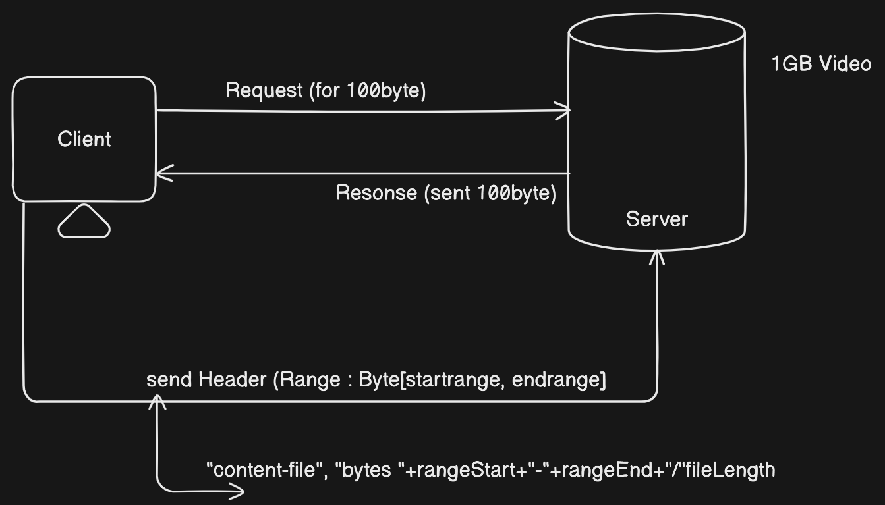

<h1>Video Streaming API</h1>

<p align="center">
  
  
</p>

<p align="center">
  
</p>

## Overview

This API provides endpoints for managing video uploads, retrieving video metadata, and streaming videos. It is implemented using Spring Boot and supports video file storage, metadata management, and efficient streaming.

## Features

- **Video Upload**: Allows users to upload video files with associated metadata.
- **Metadata Retrieval**: Provides details about the uploaded videos.
- **Video Streaming**: Supports streaming videos directly by their ID.
- **Chunked Streaming**: Allows partial content delivery and seeking within videos.

## Setup and Installation

### Prerequisites

- Java 11 or higher
- Maven
- PostgreSQL (optional, depending on your storage choice)

### Setting Up PostgreSQL with Docker (if using PostgreSQL)

1. **Pull PostgreSQL Docker Image**

    ```bash
    docker pull postgres:latest
    ```

2. **Run PostgreSQL Container**

    ```bash
    docker run --name postgres-container -e POSTGRES_USER=postgres -e POSTGRES_PASSWORD=yourpassword -e POSTGRES_DB=yourdatabase -p 5432:5432 -d postgres:latest
    ```

   Replace `yourpassword` and `yourdatabase` with your desired password and database name.

### Backend Setup

1. **Clone the Repository**

    ```bash
    git clone https://github.com/your-repo/video-streaming-api.git
    cd video-streaming-api
    ```

2. **Install Dependencies**

    ```bash
    mvn install
    ```

3. **Set Up Environment Variables**

   Create a `application.properties` file in the `src/main/resources` directory and add the following variables:

    ```properties
    spring.datasource.url=jdbc:postgresql://localhost:5432/yourdatabase
    spring.datasource.username=postgres
    spring.datasource.password=yourpassword
    ```

   Replace `yourpassword` and `yourdatabase` with your PostgreSQL password and database name.

4. **Run the Application**

    ```bash
    mvn spring-boot:run
    ```

### Usage

1. **Access the API**

   The API will be accessible at `http://localhost:8080`.

2. **Upload Videos**

   Use the `/api/v1/videos` endpoint to upload videos.

3. **Stream Videos**

   Stream videos using the `/api/v1/videos/stream/{videoId}` endpoint.

4. **Retrieve Metadata**

   Get video metadata using the `/api/v1/videos` endpoint.

## Contributing

Contributions are welcome! Please open an issue or submit a pull request for any enhancements or bug fixes.
